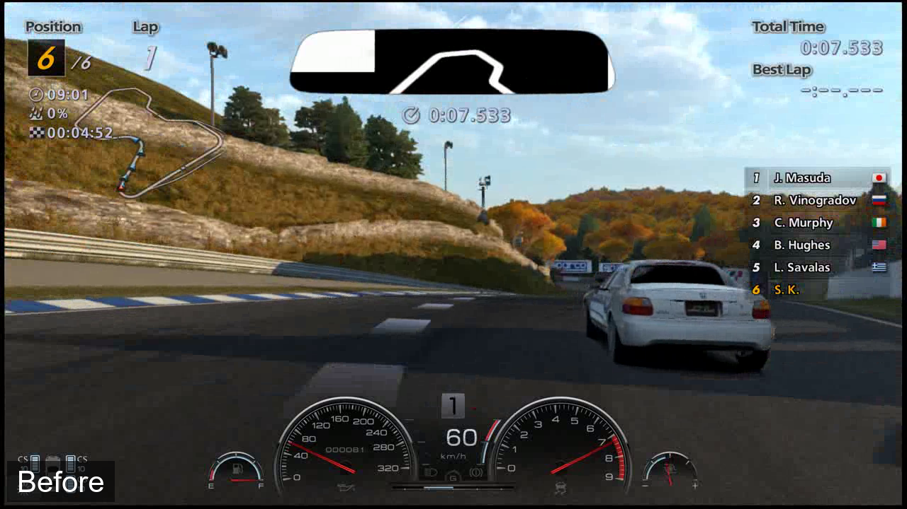
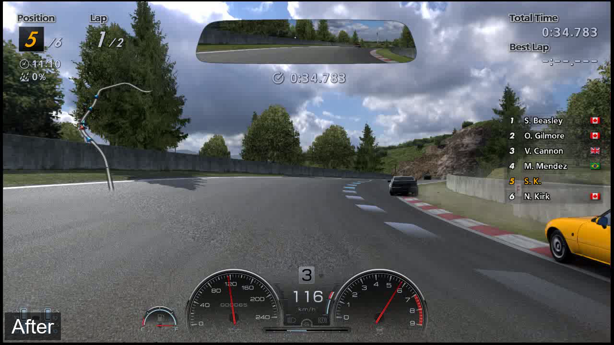

# RPCS3 GT6 Mirror Fix - Experimental Public Test Build

This repository publishes an **unofficial experimental Windows test build** for two Gran Turismo 6 mirror issues in RPCS3.

It is **not an official RPCS3 build**, not an upstream-ready pull request, and not intended for general RPCS3 support requests. The RPCS3 wiki support guidance says support should be based on the latest official build, so please treat this only as a focused public test artifact.

## Target

Tested locally:

```text
Game: Gran Turismo 6
Title ID: BCES01893
Game version: 1.05
Base RPCS3 commit: b533a560e6df6f8aa1c271bfffbd1e39f500bd65
Embedded version before patch: 19374-b533a560
```

## Intended Fixes

- Default 2D HUD rear-view mirror showing wrong content such as minimap-like data.
- Car/material flicker in the default HUD mirror and cockpit mirrors.

## Visual Comparison

<table>
  <tr>
    <td></td>
    <td></td>
  </tr>
</table>

**Video:** [GT6 mirror visual comparison](media/gt6-mirror-visual-comparison.mp4)

The short comparison video shows:

- the default HUD mirror sampling the track map texture
- cockpit mirror car-surface flicker on unpatched master
- the observation that the surface flicker stops inside tunnels
- the experimental patched build rendering the HUD and cockpit mirrors stably

## Recommended GT6 Test Config

```text
Read Color Buffers: true
Write Color Buffers: true
Asynchronous Texture Streaming: true
Multithreaded RSX: true
Resolution Scale: 100
```

During local testing, unrelated full-screen flicker was traced to configuration and disappeared with the settings above.

## Files

- `gt6-mirror-fix-b533a560e.patch` - source diff against the base commit.
- `gt6_mirror_public_testing.md` - test notes, known limits, and cross-checks.
- `media/gt6-mirror-visual-comparison.mp4` - before/after comparison video.
- `SHA256SUMS.txt` - hashes for the release payload.
- `LICENSE-RPCS3-GPLv2.txt` - RPCS3 license text copied from the base source tree.

The executable and ZIP package are attached to the GitHub release, not committed to this repository.

## Known Limits

- Tested locally only on `BCES01893` so far.
- Not title-gated.
- Relies on observed GT6 RSX addresses, dimensions, and scissor patterns.
- Should be treated as an experimental workaround for public testing and review, not as a merge proposal.

## Cross-Checks

- Gran Turismo 5 Prologue: rear-view mirror path appears different; GT6 mirror bugs not observed; no visible regressions.
- Need for Speed Shift: rear-view mirror path appears different; GT6 mirror bugs not observed; no visible regressions.

## Source Availability

This package includes the patch required to reproduce the build from RPCS3 commit `b533a560e6df6f8aa1c271bfffbd1e39f500bd65`.

Upstream RPCS3 source is available at:

```text
https://github.com/RPCS3/rpcs3
```

## AI Transparency

This experiment was developed collaboratively by SputnikKaputtnik and OpenAI Codex/ChatGPT. See `AI_TRANSPARENCY.md`.
